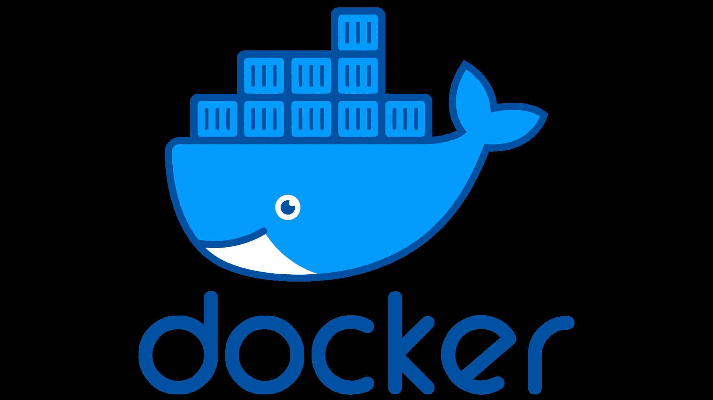
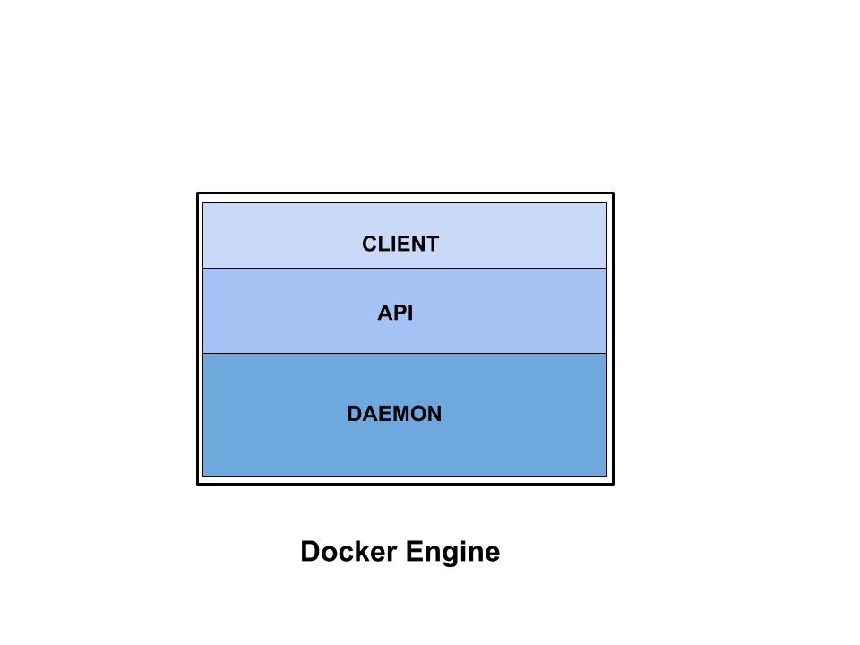

# Docker or What?

### 1.1 - What is Docker?



Docker is **not a virtual machine (VM)**. Instead, Docker uses operating-system-level virtualization to run applications in isolated **containers**.

Docker containers share the host system's kernel, which makes them much more lightweight than traditional virtual machines. Because containers do not require a complete guest operating system for each application, they generally require less RAM, CPU, and storage.

For example, if you want to run a service using VMware, you normally need to run a complete virtual machine, including a guest operating system. This requires additional CPU, RAM, and storage resources.

With Docker, the same service can often run inside a lightweight container with significantly fewer resources.

---

### 2.1 - Docker Technology

At a high level, there are two major parts of the Docker platform:

* **The CLI (Client):** A command-line tool for deploying and managing containers. It converts user commands into API requests and sends them to the Docker Engine.
* **The Engine (Server):** The server-side component that receives API requests and manages containers.

**Figure 1.1 - The different sections of Docker**



| Component | Description                                                                                                                                                  |
| --------- | ------------------------------------------------------------------------------------------------------------------------------------------------------------ |
| `Client`  | The client is the interface through which the user interacts with Docker. It receives commands from the user and sends requests to the Docker API.           |
| `API`     | Think of the API as a translator. It allows the client to communicate with the Docker Engine using a defined interface.                                      |
| `Daemon`  | The Docker daemon is a background process that listens for Docker API requests and manages Docker objects such as containers, images, networks, and volumes. |

---

### 2.2 - A Simple Example

The user types the following command into the CLI. The CLI converts the command into an API request and sends it to the Docker daemon. The daemon then processes the request and performs the required operation.

```bash
sudo docker
```

**Figure 1.2 - A clearer representation of this process**


